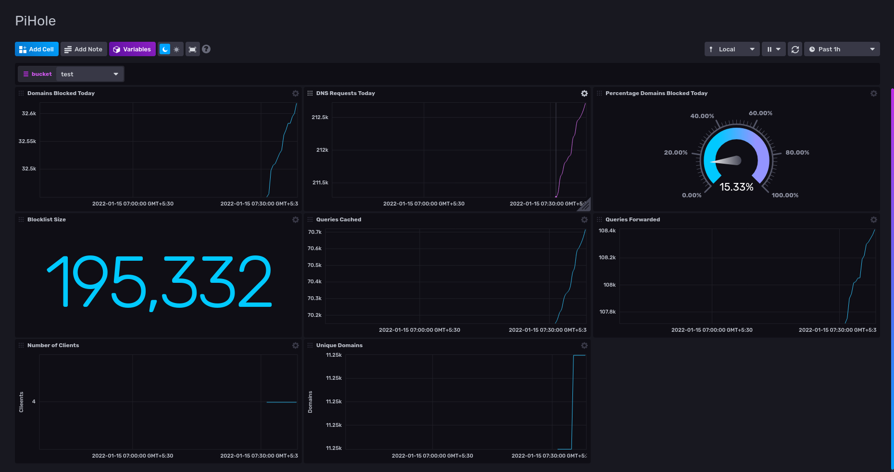

### PiHole Influx Agent
---

Push PiHole metrics to Influx DB directly. Supports the Influx DB V2 API.



#### Usage

##### Build

- Install using `cargo`: `cargo install pihole-influx-agent`; OR
- Download for your architecture from the Releases page; OR
- Clone the project and use `cargo build --release` to compile

##### Run

```bash
$ pihole-influx-agent --help
pihole-influx-agent 0.1.0

USAGE:
    pihole-influx-agent [FLAGS] [OPTIONS] <pihole-hostname> <influx-db-host> <influx-db-token> <influx-db-bucket> <influx-db-org-id>

FLAGS:
    -h, --help               Prints help information
        --influx-https
        --influx-insecure
        --pihole-https
        --pihole-insecure
    -V, --version            Prints version information

OPTIONS:
    -i, --interval-seconds <interval-seconds>     [default: 30]

ARGS:
    <pihole-hostname>      [env: PIHOLE_HOSTNAME=]
    <influx-db-host>       [env: INFLUX_DB_HOST=]
    <influx-db-token>      [env: INFLUX_DB_TOKEN=]
    <influx-db-bucket>     [env: INFLUX_DB_BUCKET=]
    <influx-db-org-id>     [env: INFLUX_DB_ORG_ID=]

$ RUST_LOG=info PIHOLE_HOSTNAME=<host> INFLUX_DB_HOST=<host> INFLUX_DB_TOKEN=<token> INFLUX_DB_ORG_ID=<org-id> INFLUX_DB_BUCKET=<bucket> ./target/debug/pihole-influx-agent --influx-insecure --influx-https
[2022-01-15T14:01:44Z INFO  pihole_influx_agent] Received summary from PiHole: 32457 domains blocked today
```

Logging can be controlled via the [`RUST_LOG` environment variable](https://rust-lang-nursery.github.io/rust-cookbook/development_tools/debugging/config_log.html)

##### Dashboard

1. Use the template.json to add a dashboard to the InfluxDB UI.
2. Choose bucket name from the drop down.

